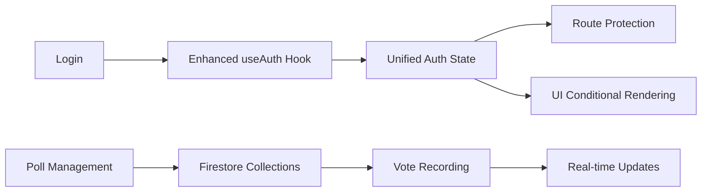

# Design Document

## Overview

The tournament voting system extends the existing authentication infrastructure to support player-based login alongside Firebase authentication. It introduces a unified login page, enhanced authentication state management, and a voting interface integrated into the tournament page. The system maintains backward compatibility with existing admin authentication while adding new player authentication capabilities.

## Architecture

### Authentication Flow

```mermaid
graph TD
    A[/login Page] --> B{Auth Method}
    B -->|Email/Google| C[Firebase Auth]
    B -->|Username/Password| D[Player Auth]

    C --> E[Check authorized_emails]
    E -->|Authorized| F[Get Admin Role]
    E -->|Not Authorized| G[Sign Out & Redirect]

    D --> H[Validate Player Credentials]
    H -->|Valid| I[Create Player Session]
    H -->|Invalid| J[Show Error]

    F --> K[Redirect to /admin]
    I --> L[Redirect to /tournament]
    G --> A
    J --> A
```

### Data Flow



## Components and Interfaces

### Enhanced Authentication State

```typescript
interface EnhancedAuthState {
  // Existing Firebase user
  user: User | null;
  loading: boolean;
  isAuthorized: boolean;
  role: UserRole;
  username: string;
  displayName: string;

  // New player authentication
  playerUser: PlayerUser | null;
  authType: "firebase" | "player" | null;
  isPlayer: boolean;
}

interface PlayerUser {
  id: string;
  name: string;
  hasVoted: boolean;
  loginPassword: string;
}
```

### Database Collections

#### Enhanced Players Collection

```typescript
interface Player {
  id: string;
  name: string;
  phoneNumber: string | null;
  category: "Noob" | "Pro" | "Ultra Noob" | "Ultra Pro";
  balance?: number;

  // New authentication fields
  loginPassword?: string;
  isLoginEnabled?: boolean;
  lastLoginAt?: string;
}
```

#### New Polls Collection

```typescript
interface Poll {
  id: string;
  question: string;
  type: "yes_no" | "yes_no_maybe" | "multiple_choice";
  options: string[]; // For multiple choice
  isActive: boolean;
  createdAt: string;
  createdBy: string; // Admin user ID
  expiresAt?: string;
}
```

#### New Poll Votes Collection

```typescript
interface PollVote {
  id: string;
  pollId: string;
  playerId: string;
  playerName: string;
  vote: string;
  votedAt: string;
}
```

### Component Structure

#### Unified Login Page (`/app/login/page.tsx`)

- Multiple authentication tabs/sections
- Name autocomplete component for player login
- Firebase authentication forms
- Unified error handling and loading states

#### Enhanced Tournament Page

- Conditional Vote tab rendering based on auth state
- Vote interface component
- Real-time poll updates

#### Admin Poll Management

- Poll creation and editing interface
- Vote results dashboard
- Player management with password controls

## Data Models

### Authentication Context Enhancement

```typescript
const AuthContext = createContext<{
  authState: EnhancedAuthState;
  loginAsPlayer: (name: string, password: string) => Promise<void>;
  logout: () => Promise<void>;
  refreshAuthState: () => Promise<void>;
}>({});
```

### Poll Management Service

```typescript
class PollService {
  async createPoll(poll: Omit<Poll, "id" | "createdAt">): Promise<string>;
  async updatePoll(id: string, updates: Partial<Poll>): Promise<void>;
  async deletePoll(id: string): Promise<void>;
  async getActivePolls(): Promise<Poll[]>;
  async getPollResults(pollId: string): Promise<PollVote[]>;
  async submitVote(
    pollId: string,
    playerId: string,
    vote: string
  ): Promise<void>;
  async hasPlayerVoted(pollId: string, playerId: string): Promise<boolean>;
}
```

### Player Authentication Service

```typescript
class PlayerAuthService {
  async validatePlayerCredentials(
    name: string,
    password: string
  ): Promise<Player | null>;
  async getPlayerSuggestions(query: string): Promise<Player[]>;
  async updatePlayerPassword(
    playerId: string,
    newPassword: string
  ): Promise<void>;
  async enablePlayerLogin(playerId: string, password: string): Promise<void>;
  async disablePlayerLogin(playerId: string): Promise<void>;
}
```

## Error Handling

### Authentication Errors

- Invalid player credentials
- Player account disabled
- Session expiration
- Network connectivity issues

### Voting Errors

- Poll not found or expired
- Duplicate voting attempts
- Invalid vote options
- Database write failures

### Admin Errors

- Insufficient permissions
- Poll creation/update failures
- Player management errors

## Testing Strategy

### Unit Tests

- Authentication state management
- Poll service methods
- Player authentication validation
- Vote submission logic

### Integration Tests

- Login flow for all user types
- Poll creation and voting workflow
- Authentication state persistence
- Route protection behavior

### Component Tests

- Login page with multiple auth methods
- Vote tab conditional rendering
- Poll management interface
- Name autocomplete functionality

### End-to-End Tests

- Complete player voting workflow
- Admin poll management workflow
- Authentication state transitions
- Cross-browser compatibility

## Security Considerations

### Player Authentication

- Password complexity requirements for admin-assigned passwords
- Rate limiting on login attempts
- Session timeout management
- Secure password storage (hashed)

### Vote Integrity

- One vote per player per poll enforcement
- Vote tampering prevention
- Audit trail for all voting actions
- Admin action logging

### Data Protection

- Player data privacy
- Secure credential transmission
- Database access controls
- Input validation and sanitization
